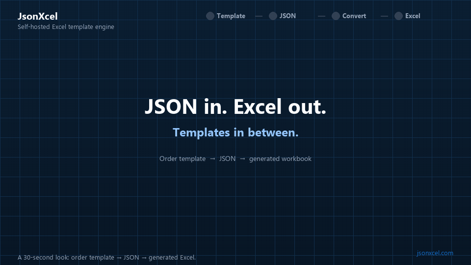

# JsonXcel

**Self-hosted Excel template engine. JSON in, Excel/PDF out.**

JsonXcel binds multilingual Excel templates to JSON through one `POST /api/convert` call. Layout stays in Excel. Data stays on your network.

**Languages:** [English](README.md) · [简体中文](README.zh-CN.md) · [繁體中文](README.zh-TW.md) · [日本語](README.ja.md) · [한국어](README.ko.md)



## Start here

| | |
|---|---|
| Product | [jsonxcel.com/en/](https://www.jsonxcel.com/en/) |
| Learn | [jsonxcel.com/en/learn/](https://www.jsonxcel.com/en/learn/) |
| Download | [jsonxcel.com/en/download/](https://www.jsonxcel.com/en/download/) |

This repository is the **Learn** site (9 modules · 30+ lessons). GitHub Pages mirror: [jsonxcel.github.io/learn-jsonxcel/en/](https://jsonxcel.github.io/learn-jsonxcel/en/).

## Quickstart

Run **JsonXcel.WebServer** locally (default `http://127.0.0.1:5000`), put a workbook under `Templates/{language}/`, then convert:

```javascript
const res = await fetch("http://127.0.0.1:5000/api/convert", {
  method: "POST",
  headers: { "Content-Type": "application/json" },
  body: JSON.stringify({
    template_name: "lesson_m01_first_convert",
    language: "en-US",
    output_format: "excel",
    return_file_stream: true,
    ds: JSON.stringify({ name: "Ada", age: 36 })
  })
});
const blob = await res.blob(); // save as .xlsx
```

Same call with curl:

```bash
curl -X POST http://127.0.0.1:5000/api/convert \
  -H "Content-Type: application/json" \
  -d "{\"template_name\":\"lesson_m01_first_convert\",\"language\":\"en-US\",\"output_format\":\"excel\",\"return_file_stream\":true,\"ds\":\"{\\\"name\\\":\\\"Ada\\\",\\\"age\\\":36}\"}"
```

`ds` must be a **JSON string** (stringify the object), not a nested object in the request body. Switch `output_format` to `"pdf"` for print-ready files. The GIF above uses the [sales order](https://jsonxcel.github.io/learn-jsonxcel/en/learn/m09-practical/m09-l01-sales-order/) lesson — same contract, richer template.

## License

Every edition includes the **full product**. Licensing only changes whether exports carry an unlicensed notice, and how long a key stays valid.

| Edition | Price | Exports |
|---|---|---|
| **Unlicensed** | Free download | Full features. Excel adds an extra unlicensed sheet; PDF pages show an unlicensed header |
| **1-month licensed** | Free eval key | No unlicensed marks. Bound to one machine code, expires after one month |
| **Lifetime licensed** | **$900** one-time | No unlicensed marks. Bound to one machine code; a new server needs a new key |

Get a key from [Pricing](https://www.jsonxcel.com/en/pricing/). Digital product: no refunds after a lifetime key is issued.

## Download JsonXcel.WebServer

Prebuilt packages (self-contained; no .NET SDK required):

| Platform | Package | Download |
|----------|---------|----------|
| Windows x64 | `JsonXcel-win-x64.zip` | [Latest](https://github.com/jsonxcel/learn-jsonxcel/releases/latest/download/JsonXcel-win-x64.zip) |
| Linux x64 | `JsonXcel-linux-x64.zip` | [Latest](https://github.com/jsonxcel/learn-jsonxcel/releases/latest/download/JsonXcel-linux-x64.zip) |

All versions: <https://github.com/jsonxcel/learn-jsonxcel/releases>

Unpack, start the server, copy lesson templates into `Templates/{language}/`, then open a lesson and use **Generate Excel**.

> Release asset names above are the contract for “latest” links. When you publish a Release, attach files with **exactly** these names (or update the links here and in `hugo.toml`).

## Browse the tutorials

- English: `/en/learn/`
- 简体中文: `/zh-cn/learn/`
- 繁體中文: `/zh-tw/learn/`
- 日本語: `/ja/learn/`
- 한국어: `/ko/learn/`

Primary technical prose is **English** and **简体中文**. Other locales share the same markers, JSON keys, and `template_name` values.

## Run this Hugo site locally

Requirements: [Hugo Extended](https://gohugo.io/installation/) (0.120+ recommended), Node.js 20+ (theme CSS).

```bash
# Theme CSS (once, or when styles change)
cd hugo-theme-ete   # or ../hugo_template/hugo-theme-ete in the monorepo layout
npm install
npm run build:css

# From the tutorial site root (this directory)
hugo server -D --port 1313
# Open e.g. http://localhost:1313/en/learn/
```

Do **not** open `public/index.html` via `file://` — Hugo sites need an HTTP server, and the root page redirects into a language subdirectory (`/en/`, …).

Build for deployment (set your real public URL):

```bash
hugo --minify -b https://learn.jsonxcel.com/
# or GitHub Pages, e.g. https://jsonxcel.github.io/learn-jsonxcel/
```

## Repository layout

```text
content/{lang}/learn/       # lesson Markdown
assets/templates/{BCP-47}/  # lesson_*.xlsx
assets/samples/{BCP-47}/    # sample JSON for demos
assets/previews/{BCP-47}/   # template.png + result.png
docs/media/                 # README demo GIF
hugo.toml                   # site config (baseURL, API, product link, downloads)
```

BCP-47 asset folders: `en-US`, `zh-CN`, `zh-TW`, `ja-JP`, `ko-KR`.

## Related

- Product site & API docs: [www.jsonxcel.com](https://www.jsonxcel.com/)
- Maintainer / monorepo notes: [DEVELOPING.md](DEVELOPING.md)

Tutorial content and sample workbooks are provided for learning JsonXcel. The engine itself is commercial software (see [License](#license) above).
